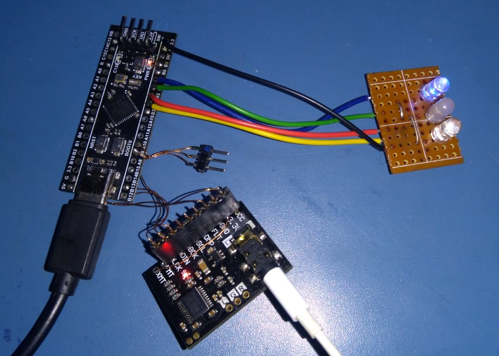
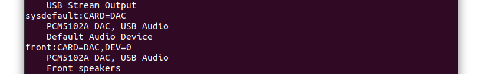
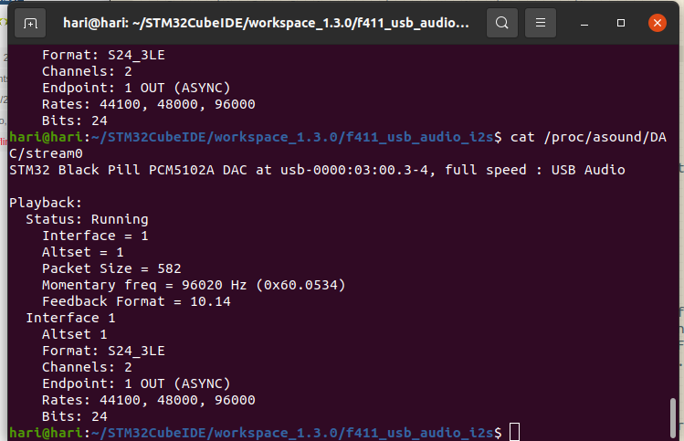
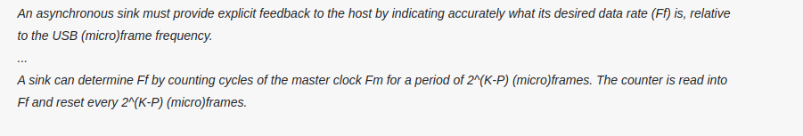
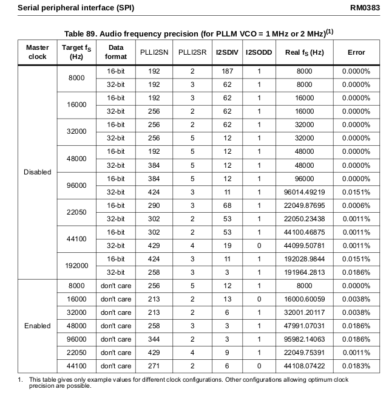
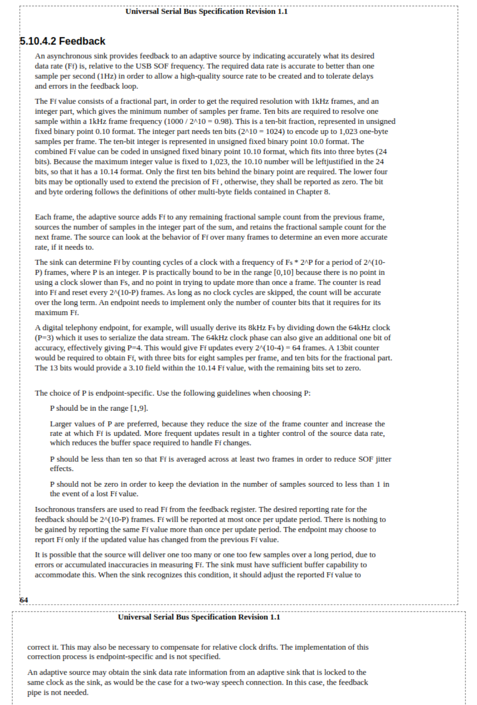

# STM32F411 USB to I2S DAC Audio Bridge

## Features

* USB Full Speed Class 1 device
* Isochronous with endpoint feedback (3bytes, 10.14 format) to synchronize sampling frequency Fs
* Bus powered
* Supports 24-bit audio streams with Fs = 44.1kHz, 48kHz or 96kHz
* I2S master output with I2S Philips standard 24/32 data frame
* Optional MCLK output generation
* Uses inexpensive Aliexpress-sourced STM32F411 "Black Pill" and PCM5102A modules. I'm pleasantly surprised to note that this USB-DAC is a noticeable improvement from my laptop headphone output, when driving my old iPhone SE standard wired earbuds. Better clarity in general and with punchier bass. I normally re-use my prototype modules for whatever new project comes to mind, but I now intend to use this as a permanent headphone driver!

## Credits
* [Dragonman USB Audio project](https://github.com/dragonman225/stm32f469-usbaudio)
* [Endpoint feedback](https://www.microchip.com/forums/m547546.aspx)

## Software Development Environment
* Ubuntu 20.04 AMDx64
* STM32CubeIDE v1.3.0 (makefile project)

## Hardware

* WeAct STM32F411CEU6 development board
    **I2S2 interface to PCM5102A DAC module
    **SWD interface to ST-LinkV2 adapter for flashing code
    **UART2 serial interface for debug using PL2303 USB-UART adapter
* PCM5102A I2S DAC module
    **FLT, DMP, SCL, FMT pins grounded
    **XMT connected to 3.3V
    **100uF 6.3V tantalum capacitor across VCC and ground 
    **VCC connected to 5V pin on STM32F411 Black Pill board

## Checking USB Audio device on Ubuntu 20.04

* Execute `lsusb` with and without the USB-Audio DAC plugged in, you should see the 
  new USB device
  

  
* Execute `aplay -L` and look for `PCM5102 DAC`

* Run the `Sound` application without the USB-Audio DAC plugged in and check the
  Speaker/Headphone output options
* Plug in the USB-Audio DAC and check again, you should see at least one new option.
  Select this for playing sound output via the USB-Audio DAC
* Execute `cat /proc/asound/DAC/stream0` when a song is playing

## Optimizing Pulseaudio on Ubuntu 20.04 for USB-Audio DAC

* Edit `/etc/pulse/daemon.conf` as root
* Force re-sampling to 96kHz
* Resize to 24bits
* Use highest quality re-sampling algorithm
* Save file, log out and log in again for the changes to take effect

## Endpoint Feedback mechanism

Unfortunately, we do not have any means of measuring the actual Fs (accurate to 10.14 resolution)
generated by the PLLI2S peripheral on an SOF resolution interval of 1mS. So we calculate
a nominal Fs value by assuming the HSE crystal has 0ppm accuracy (no error), and use the PLLI2S N,R,
I2SDIV and ODD register values to compute the generated Fs value. For example when MCLK output
is disabled, the optimal register settings result in a value of 96.0144kHz.

Since the USB host is asynchronous to the PLLI2S Fs clock generator, the incoming Fs rate of audio packets will be different. So we need
to have a circular buffer of audio packets to accommodate the difference in incoming and outgoing Fs. 

The USB driver writes incoming audio packets to this buffer while the I2S transmit DMA reads from this buffer. We start I2S playback when the buffer is half full, and then try to maintain this position, i.e. the difference between the write pointer and read pointer should optimally be half of the buffer size.

Any change to this pointer distance implies the usb host and i2s playback Fs values are not in sync.
To correct this, we implement a PID style feedback mechanism where we report an ideal Fs feedback frequency
based on the deviation from the nominal pointer distance. We want to avoid the write process overwriting the unread packets, and we also want to minimize the oscillation in Fs due to unnecessarily large corrections.

This is a debug log of changes in Fs due to the implemented mechanism. The first datum is the SOF frame counter, the second is the pointer distance in samples, the third is the feedback Fs. As you can see, the feedback is able to minimize changes in pointer distance AND oscillations in Fs frequency.

