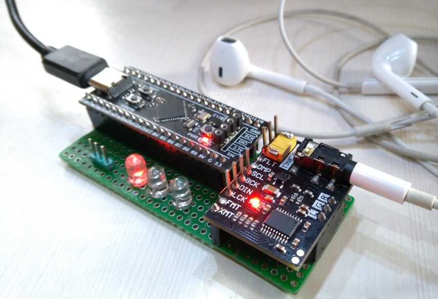
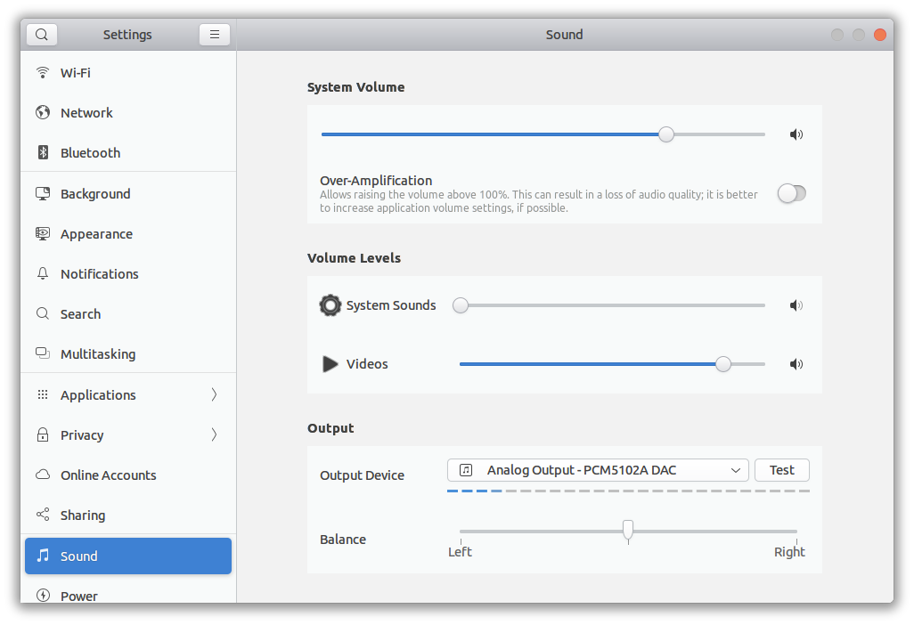
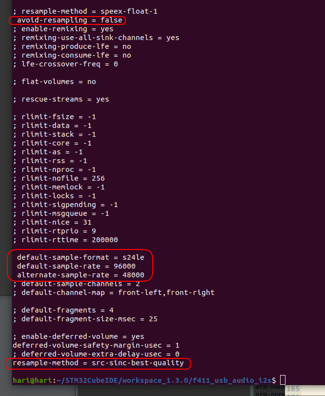
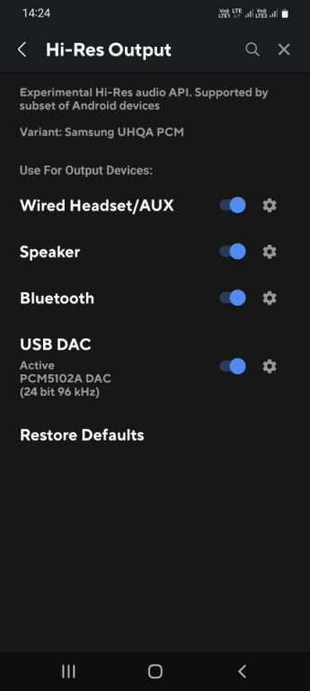
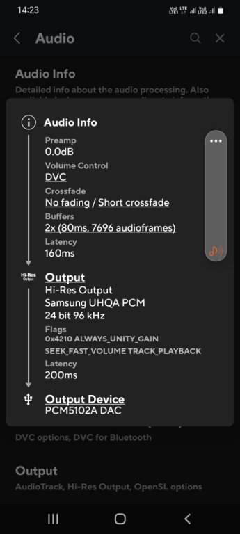

# USB Hi-Res Stereo Audio DAC using STM32F4xx "Black Pill" and PCM5102A or UDA1334ATS DAC

* USB Full Speed Class 1 Audio device, no driver installation required
* USB Bus powered
* Supports 24-bit audio streams with sampling frequency Fs = 44.1kHz, 48kHz or 96kHz
* USB Audio Volume (0dB to -96dB, 3dB steps) and Mute support
* Isochronous with endpoint feedback (3bytes, 10.14 format) to synchronize sampling frequency Fs
* Uses inexpensive [STM32F4xx "Black Pill"](https://stm32-base.org/boards/STM32F411CEU6-WeAct-Black-Pill-V2.0) module. Support for STM32F401CCU6 or STM32F411CEU6 black pill modules.
* Texas Instruments PCM5102A or Philips UDA1334ATS DAC modules

When the USB Audio DAC device is enumerated on plug-in, it reports its capabilities 
(audio class, sampling frequency options, bit depth). If you configure the host audio 
playback settings optimally (see section below), a native 96kHZ 24bit audio file will play unmodified, 
while a 44.1kHz or 48kHz 16bit stream will be resized to 24bits and resampled to 96kHz.

I now understand why there is a market for audiophile DACs with higher end headphones. 
I was given a pair of used Grado SR60 headphones a long time ago and was unimpressed. 
With my laptop and smartphone headphone outputs they didn't sound particularly remarkable. 
In fact, they were lacking in bass response. And they are bulky, with a heavy cable. So they
were gathering dust in storage.  
I retrieved the Grado headphones and tried them out with the USB DAC. The difference was astonishing.  
I'm no golden-ears audiophile, but the amount of detail and frequency response is impressive. 
Have a look at this 
[Cambridge Audio website](https://www.cambridgeaudio.com/row/en/blog/our-guide-usb-audio-why-should-i-use-it?fbclid=IwAR33SS0e_jNiQ1tBSOj29KdEOi1mhHn1r87bMg-VyAMmR2NeSmKETod-JkY#:~:text=Class%201%20will%20give%20you,step%20up%20to%20Class%202) 
comparing a dedicated USB Audio Class 1 DAC to a laptop headphone output. I have to agree with them.

Even 44.1kHz/16bit MP3 files sound much better when played back via the USB DAC. The Texas Instruments PCM5102A isn't 
marketed as an "audiophile" component, but it evidently can drive high-quality headphones well.
Note : The Philips UDA133ATS DAC module works just as well - there is some residual background noise when there is no streaming audio, but that could be a wiring issue.

I normally re-cycle my prototype modules for new projects, but I am now using this setup as a 
permanent headphone driver.

For a "budget audiophile" experience, try the Venus Electronics Monk Plus in-ear phones with the 
USB DAC. These headphones are (and look) inexpensive, but they have high dynamic range
with no distortion at higher volumes.

# Credits
* [Dragonman USB Audio project](https://github.com/dragonman225/stm32f469-usbaudio)
* [Endpoint feedback](https://www.microchip.com/forums/m547546.aspx)

# Software Development Environment
* Ubuntu 22.04 AMDx64
* STM32CubeIDE v1.16.0 (required only for toolchain binaries)
* [STLink V2 tools v 1.8.0-1](https://github.com/stlink-org/stlink/releases). Install the .deb package using `sudo apt install xxx.deb`. I used a cheap STLink V2 clone. It accepted a firmware upgrade from STM32CubeIDE v1.16.0 and still works (YMMV). Connect ONLY the SCK, DIO and GND pins on the STLink V2 SWD interface. Connect the Black Pill via USB cable  to the host to supply 5V power.

## Build and flash  from Terminal 
* The project is a bare bones Makefile project and has now been updated to use a snapshot of CMSIS and HAL code from STM32 F4 firmware library v1.28.0. You do not need to install this library unless you want to create your own F4xx projects using STM32CubeIDE. 
* Edit flags in `Makefile` to
  * Select STM32F411 or STM32F401 MCU
  * Enable MCLK output generation on STM32F411 (optional, for DACs that cannot generate MCK internally from the bit clock) 
  * Select PCM5102A or UDA1334ATS DAC
  * Enable diagnostic printout on serial UART port.
* Add the the paths to the toolchain (compiler & linker, make) to your environment PATH variable. Installing stlinker v2 tools should have
already added the path to st-flash.
* Run `make clean`, `make all`, `make flash`
  to build and flash the binary. Check `docs/example_build.txt`.

## Build and flash from STM32CubeIDE
 Copy the project source folder to the STM32CubeIDE workspace directory, then select `File -> Import -> Existing projects into workspace`  to add the project to your workspace.
  
  Copy `Project -> Settings -> C/C++ build -> Environment -> PATH`  from any existing STM32CubeIDE project for 
  the F4xx MCU. Create and build a dummy project if you don't have one already. You will have to install the F4 firmware library 1.28.0 package via the `Help -> Manage Embedded Software Packages`.
  Then you can invoke the build  from the IDE. 
  
# Hardware

* STM32F4xx I2S master output with I2S Philips standard 24/32 data frame
    * I2S_2 peripheral interface generates WS, BCK, SDO
    * Optional MCLK output generation on STM32F411. MCLK frequency = 256 x Fs
* External R, G, B LEDs indicate sampling frequency 96kHz, 48kHz, 44.1kHz respectively
* On-board LED (pin PC13) for diagnostic status
* UART2 serial interface @ 115200baud for diagnostic information
* PCM5102A I2S DAC module : MCK generated internally.
* UDA1334ATS I2S DAC module : SF0, SF1, SCLK, PLL, DEEM pin default board  configuration OK, leave open. MCK generated internally.
* 100uF 16V capacitor and 5V TVS diode in parallel, connected from 5V to ground 

```
F4xx  PCM5102A  UDA1334ATS  LED   UART   Description
-----------------------------------------------------------------------------------------
5V    VCC       VIN                      
-     3V3       3V0                      Open           
GND   GND       GND 
GND   FLT                                Filter Select = Normal latency
GND   DMP                                De-emphasis off
GND   SCL                                Generate I2S_MCK internally
GND             SF0                      Format = I2S
GND             SF1                           "
B13   BCK       BCLK                     I2S_BCK (Bit Clock)
B15   DIN       DIN                      I2S_SDI (Data Input)
B12   LCK       WSEL                     I2S_WS (LR Clock)
GND   FMT                                Format = I2S
B8    XMT       MUTE                     Mute (active low PCM5102A/active high UDA1334ATS)
A6    -                                  I2S_MCK (not used)
------------------------------------------------------------------------------------------
B3                         RED           Fs = 96kHz
B6                         GRN           Fs = 48kHz
B9                         BLU           Fs = 44.1kHz
C13                     on-board         Diagnostic
------------------------------------------------------------------------------------------
A2                                TX     Serial debug
A3                                RX        "
GND                               GND       "
A0                                       KEY button. Triggers endpoint feedback printout 
                                         if enabled with DEBUG_FEEDBACK_ENDPOINT
-----------------------------------------------------------------------------------------
```    



# Checking USB Audio device on Ubuntu 22.04

Check `docs/verify_setup.txt` for the commands used to verify the setup.

Run the `Settings -> Sound` application and ensure the PCM5102A DAC device
is selected for playback.



# Optimizing Pulseaudio on Ubuntu 22.04

Edit `/etc/pulse/daemon.conf` as root
* Force re-sampling to 96kHz
* Resize to 24bits
* Use highest quality re-sampling algorithm
* Save file, log out and log in again for the changes to take effect



# Pipewire on Ubuntu 22.04LTS

Copy `/etc/pipewire/pipewire.conf` to `~/.config/pipewire/pipewire.conf`. Change the setting of
the default clock rate in context.properties :

```
    default.clock.rate          = 96000
```

Log out and after logging back in, play back an audio file via the USB DAC. Run
the command :

```
pactl list sinks
```

You should see confirmation that the audio is being resampled to 24bits and a sample rate of 96kHz.

```
...
Sink #54
	State: RUNNING
	Name: alsa_output.usb-STM32_Black_Pill_PCM5102A_DAC_327F368E3334-00.iec958-stereo
	Description: PCM5102A DAC Digital Stereo (IEC958)
	Driver: PipeWire
	Sample Specification: s24le 2ch 96000Hz
	Channel Map: front-left,front-right
...
```


# Optimizing Windows 10

Control Panel Sound playback device properties dialog


# Optimizing Android
After using customization settings in Poweramp music player on a Samsung Galaxy F62 :




# Endpoint Feedback mechanism


Unfortunately, we do not have any means of measuring the actual Fs (accurate to 10.14 resolution)
generated by the PLLI2S peripheral on an SOF resolution interval of 1mS. So we calculate
a nominal Fs value by assuming the HSE crystal has 0ppm accuracy (no error), and use the PLLI2S N,R,
I2SDIV and ODD register values to compute the generated Fs value. For example when MCLK output
is disabled, the optimal register settings result in a value of 96.0144kHz.


Since the USB host is asynchronous to the PLLI2S Fs clock generator, the incoming Fs rate of audio packets will be slightly different. We use
a circular buffer of audio packets to accommodate the difference in incoming and outgoing Fs. 

The USB driver writes incoming audio packets to this buffer while the I2S transmit DMA reads from this buffer. We start I2S playback when the buffer is half full, and then try to maintain this position, i.e. the difference between the write pointer and read pointer should optimally be half of the buffer size.

Any change to this pointer distance implies the USB host and I2S playback Fs values are not in sync.
To correct this, we implement a PID style feedback mechanism where we report an ideal Fs feedback frequency
based on the deviation from the nominal pointer distance. We want to avoid the write process overwriting the unread packets, and we also want to minimize the oscillation in Fs due to unnecessarily large corrections.

This is a debug log of changes in Fs due to the implemented mechanism. The first datum is the SOF frame counter, the second is the pointer distance in samples, the third is the feedback Fs. As you can see, the feedback is able to minimize changes in pointer distance AND oscillations in Fs frequency.


# Latency

I have not measured the actual latency. The USB protocol stack and F4xx USB driver firmware will have inherent latency and I have no idea how to estimate this. 
The additional latency introduced by this firmware application is half the circular buffer size (in stereo samples) 
multiplied by the inverse of the sampling frequency Fs.

A single stereo sample uses 2x3 = 6 bytes. 
The estimated latency in seconds is ((Circular_Buffer_Size_Bytes/2) / 6) *  (1/Sampling_Freq_Hz)

The relevant configuration parameter is `AUDIO_OUT_PACKET_NUM` in `drivers/usb/Class/AUDIO/Inc/usbd_audio.h`.


