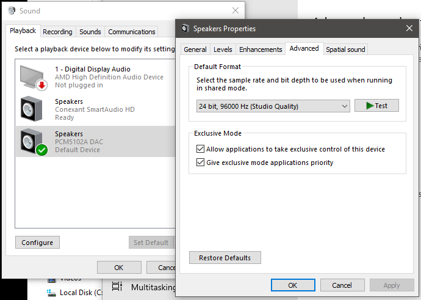

# STM32F4xx "Black Pill" USB to I2S DAC Audio Bridge

## Features

* USB Full Speed Class 1 Audio device, no special drivers needed
* Isochronous with endpoint feedback (3bytes, 10.14 format) to synchronize sampling frequency Fs
* Bus powered
* Supports 24-bit audio streams with Fs = 44.1kHz, 48kHz or 96kHz
* I2S master output with I2S Philips standard 24/32 data frame
* Optional MCLK output generation
* Uses inexpensive Aliexpress-sourced STM32F4xx "Black Pill" and PCM5102A modules.
* Build support (Makefile option) for STM32F401CCU6 and 
STM32F411CEU6 boards 

I now understand why there is a market for audiophile DACs with higher end headphones. I was given a pair of used Grado SR60 headphones a long time ago and
was unimpressed. With my laptop and smartphone headphone outputs they didn't sound great compared to my budget earbuds. In fact, they were lacking in bass response. And they are bulky, with a heavy cable. So they've been in a cupboard for the past 16-17 years.

I first noticed that my old iPhone SE standard wired earbuds sounded remarkably good with the USB-DAC, much better than my other budget earbuds and
my cheap but comfortable Sennheiser PX60 headphones.

I retrieved the Grado headphones and tried them out, the difference is astonishing.  I'm no golden-ears audiophile, but 
the amount of detail and frequency response is remarkable. I'm kind of surprised that the DACs on brand name (Lenovo & Vaio) laptops are
so poor in quality, but have a look at this [Cambridge Audio website](https://www.cambridgeaudio.com/row/en/blog/our-guide-usb-audio-why-should-i-use-it?fbclid=IwAR33SS0e_jNiQ1tBSOj29KdEOi1mhHn1r87bMg-VyAMmR2NeSmKETod-JkY#:~:text=Class%201%20will%20give%20you,step%20up%20to%20Class%202) comparing a dedicated USB Audio Class 1 DAC to a laptop headphone output. I have to agree with them.

I normally re-cycle my prototype modules for new projects, but I am now using this setup as a permanent headphone driver, and my Grado phones
are back in service.

When the USB Audio DAC device is enumerated on plug-in, it reports its capabilities (audio class, sampling frequency options, bit depth). If you configure the audio device driver optimally, a native 96kHZ 24bit audio file will play unmodified, while a 44.1kHz or 48kHz 16bit stream will be resized to 24bits and resampled to 96kHz. And yes, even 44.1kHz/16bit MP3 files sound much better when played back via the USB DAC. I'm not sure why - the PCM5102A isn't marketed as an "audiophile" component, but it obviously can drive high-quality headphones much better than standard laptop/smartphone DAC components.

## Credits
* [Dragonman USB Audio project](https://github.com/dragonman225/stm32f469-usbaudio)
* [Endpoint feedback](https://www.microchip.com/forums/m547546.aspx)

## Software Development Environment
* Ubuntu 20.04 AMDx64
* STM32CubeIDE v1.6.0 (makefile project)
* STM32 F4 library v1.26.1

## Hardware

* WeAct STM32F411CEU6 or STM32F401CCU6 "Black Pill" development board
	* I2S_2 peripheral interface generates WS, BCK and SDO. 
	* LEDs to indicate sampling frequency and diagnostic/errors.
	* UART2 serial interface for debug information
* PCM5102A I2S DAC module
	* MCK is generated internally 
	* 100uF 6.3V tantalum capacitor across VCC and ground 
```
F4xx    PCM5102A    LED     UART2   Description
--------------------------------------------------------------------
5V      VCC
-       3V3
GND     GND
GND     FLT                         Filter Select = Normal latency
GND     DMP                         De-emphasis off
GND     SCL                         Generate I2S_MCK internally
B13     BCK                         I2S_BCK (Bit Clock)
B15     DIN                         I2S_SDI (Data Input)
B12     LCK                         I2S_WS (LR Clock)
GND     FMT                         Format = I2S
B8      XMT                         Software Mute control
A6      -                           I2S_MCK (N.C.)
--------------------------------------------------------------------
B3                 RED              Fs=96kHz
B6                 GRN              Fs=48kHz
B9                 BLU              Fs=44.1kHz
C13             on-board            Diagnostic/Error
--------------------------------------------------------------------
A2                         TX       Serial debug
A3                         RX
GND                        GND
PA0                                 KEY button. Triggers endpoint  
                                    feedback printout if enabled with  
                                    DEBUG_FEEDBACK_ENDPOINT
--------------------------------------------------------------------
```    


## Checking USB Audio device on Ubuntu 20.04

* Execute `lsusb` with and without the USB-Audio DAC plugged in, you should see the 
  new USB device
  

  
* Execute `aplay -L` and look for `PCM5102 DAC`


* Run the `Sound` application without the USB-Audio DAC plugged in and check the
  Speaker/Headphone output options
* Plug in the USB-Audio DAC and check again, you should see at least one new option.
  Select this for playing sound output via the USB-Audio DAC
* Execute `cat /proc/asound/DAC/stream0` when a song is playing


## Optimizing Pulseaudio on Ubuntu 20.04 for USB-Audio DAC

* Edit `/etc/pulse/daemon.conf` as root
* Force re-sampling to 96kHz
* Resize to 24bits
* Use highest quality re-sampling algorithm
* Save file, log out and log in again for the changes to take effect


## Optimizing Windows 10 for USB-Audio DAC

* Use the Control Panel Sound playback device properties dialog




## Endpoint Feedback mechanism


Unfortunately, we do not have any means of measuring the actual Fs (accurate to 10.14 resolution)
generated by the PLLI2S peripheral on an SOF resolution interval of 1mS. So we calculate
a nominal Fs value by assuming the HSE crystal has 0ppm accuracy (no error), and use the PLLI2S N,R,
I2SDIV and ODD register values to compute the generated Fs value. For example when MCLK output
is disabled, the optimal register settings result in a value of 96.0144kHz.


Since the USB host is asynchronous to the PLLI2S Fs clock generator, the incoming Fs rate of audio packets will be slightly different. We use
a circular buffer of audio packets to accommodate the difference in incoming and outgoing Fs. 

The USB driver writes incoming audio packets to this buffer while the I2S transmit DMA reads from this buffer. We start I2S playback when the buffer is half full, and then try to maintain this position, i.e. the difference between the write pointer and read pointer should optimally be half of the buffer size.

Any change to this pointer distance implies the USB host and I2S playback Fs values are not in sync.
To correct this, we implement a PID style feedback mechanism where we report an ideal Fs feedback frequency
based on the deviation from the nominal pointer distance. We want to avoid the write process overwriting the unread packets, and we also want to minimize the oscillation in Fs due to unnecessarily large corrections.

This is a debug log of changes in Fs due to the implemented mechanism. The first datum is the SOF frame counter, the second is the pointer distance in samples, the third is the feedback Fs. As you can see, the feedback is able to minimize changes in pointer distance AND oscillations in Fs frequency.


